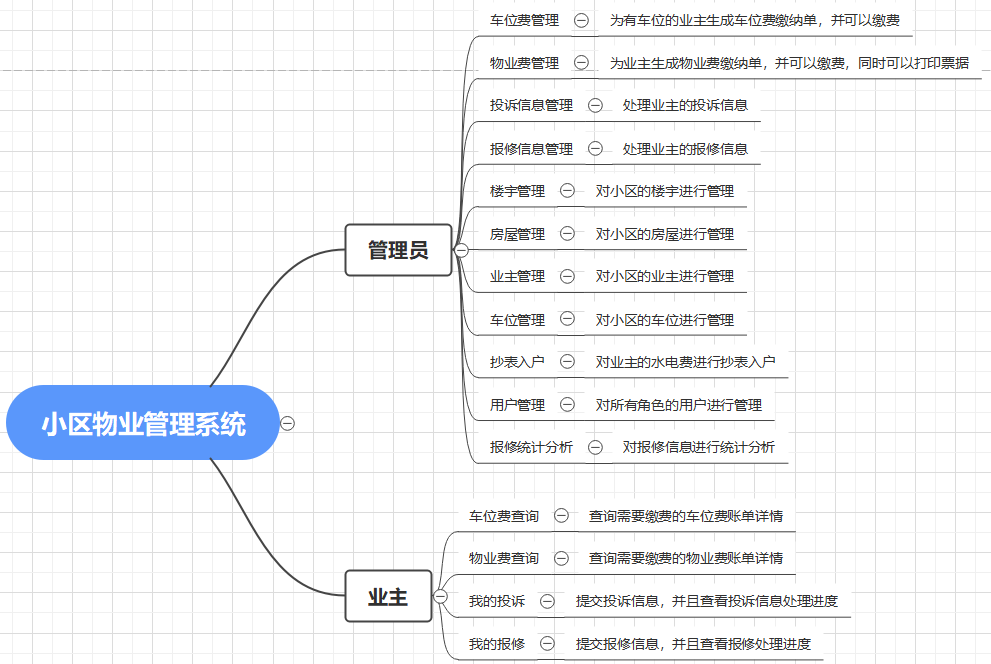
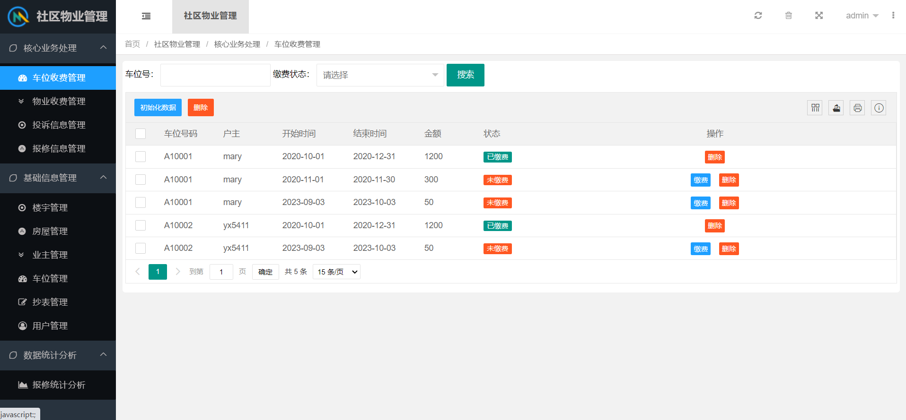
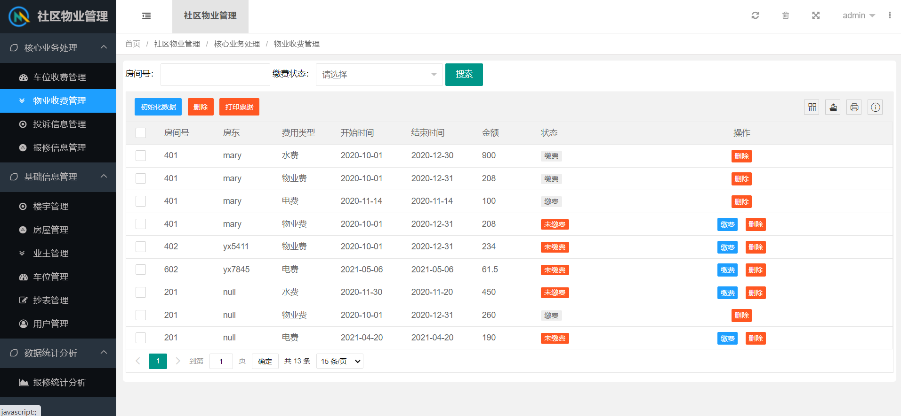
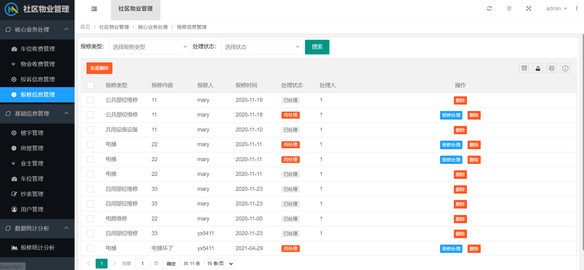
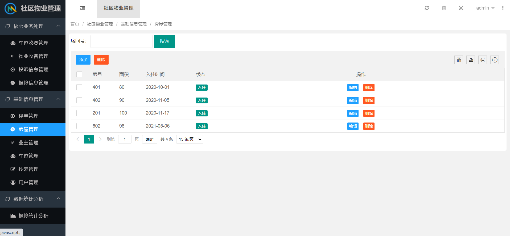
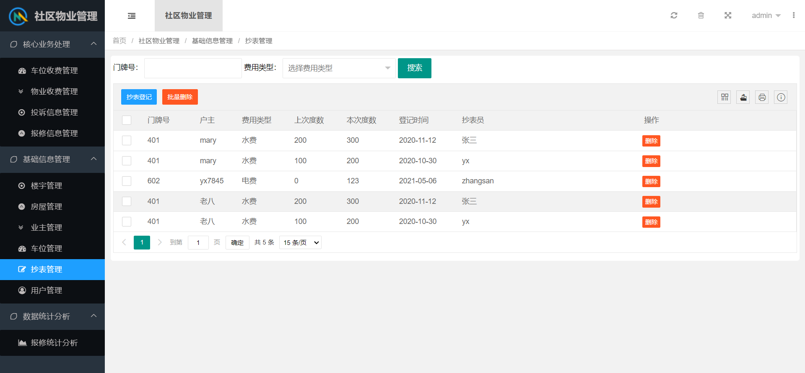
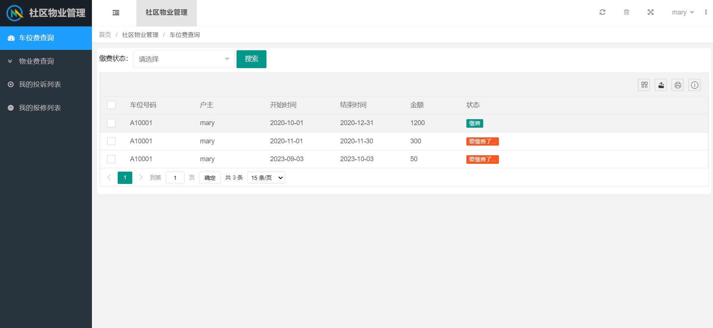

# 基于SpringBoot的小区物业管理系统 

（源代码+12000字文档+ppt）

## 项目简介

基于SpringBoot的小区物业管理系统，分为管理员和业主两个角色。 
业主可以在系统中进行费用查询、投诉、报修。管理员可以在系统中对业主进行缴费通知、缴费、维修投诉处理等操作。 
本系统后端使用springboot框架。数据库使用的是mysql数据库。 
该系统功能完善，界面美观，非常适合作为毕设或者课程作业以及新手开发学习。 

## 视频介绍
<a href="https://www.bilibili.com/video/BV1nu411M7GX/?spm_id_from=333.999.0.0" target="_blank">点击查看B站视频介绍</a>

## 功能介绍
 

## 技术服务

## 系统图片
#### 1.登录页面
 
#### 2.车位收费管理
 
#### 3.物业收费管理
 
#### 4.报修信息管理
 
#### 5.房屋管理
 
#### 6.抄表入户
 
#### 7.用户费用查询
 
